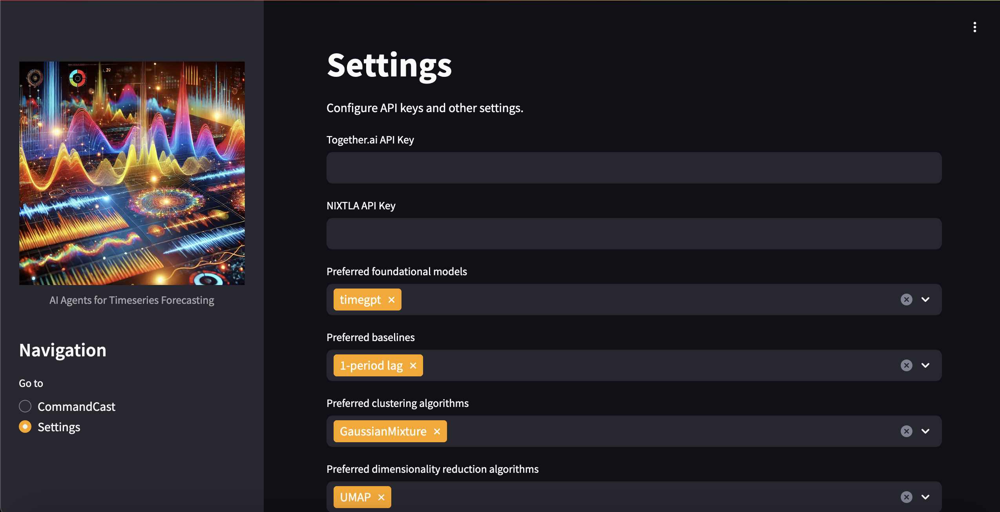
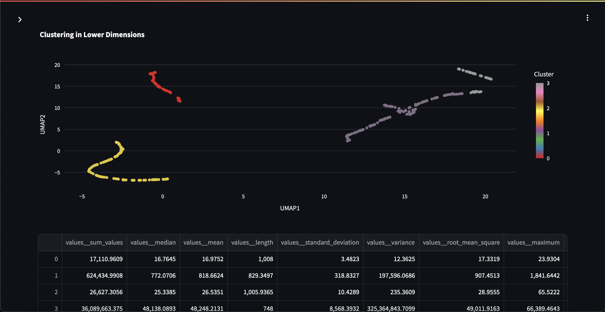

# CommandCast

## AI Agents for Timeseries Forecasting

This project focuses on allowing forecasters to generate advanced coherent, probabilistic forecasts using AI agents as an assistant. More specifically, 
users can dynamically generate new approaches, models and techniques simply by 
prompting the developer agent. 

## Available agents: ##

- **Assistant** -- AI expert at time series to help the user understand their timeseries data and forecasting challenges.
- **Developer** -- Agent capable of writing arbitrary python code, including generating new models and approaches for the platform simply by providing a scientific research paper
- **CodeExecutor** -- agent capable of securely executing arbitrary python code in a dedicated docker container.
- **StatsForecaster** -- exprt at generating statistical and econometric forecasts
- **NeuralForecaster** -- expert at generating forecasts from neural networks
- **FoundationForecaster** -- expert at generating forecasts from large foundational time series models like Nixtla's TimeGPT or Google's TimesFM
- **Reconciler** - expert at generating coherent forecasts across time, space or both.
- **Combiner** - expert at optimally combining forecasts across fitted models and timeseriees

## Configuration

Provide your preferences for foundational models, clustering and other analytical techniques.

## Data Visualization

Automatically generate timeseries decompositions and visualizations for your data.

## Automatic Timeseries Clustering

Generate segments and clusters based on your timeseries.

